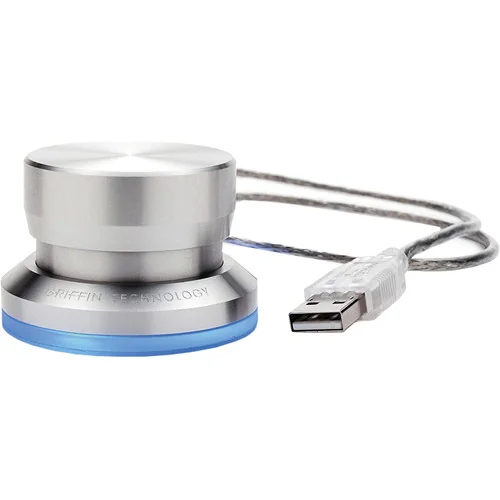

# PowerMateReborn



A project to resurrect the classic Griffin PowerMate USB for modern Mac setups (Apple Silicon and macOS Sequoia+). 

Since the official drivers haven't worked in years, this is a native Swift menu bar app built from scratch to bring that awesome piece of hardware back to life.

## Features

- **Native Swift IOKit HID Integration:** Directly reads USB events without relying on legacy drivers or Rosetta.
- **Lightweight Menu Bar App:** Unobtrusive control and mode switching directly from your macOS menu bar.
- **Multi-Mode Support:**
  - 🔊 **Volume Mode:** Controls system volume using CoreAudio, with intelligent fallbacks (e.g., AppleScript) for tricky setups.
  - ☀️ **Brightness Mode:** Controls display brightness utilizing DisplayServices private APIs (and planned DDC/CI support for external monitors).
  - ⚙️ **Custom Mode:** (In Development) Programmable actions and macros.
- **Gesture Recognition:** Supports single press, long press (mode cycling), and rotational inputs (with double-tap planned).

## Hardware Requirements

- **Device:** Griffin PowerMate USB
- **Identifiers:** Vendor ID `0x077d`, Product ID `0x0410`
- **OS:** macOS Sequoia+ (Optimized for Apple Silicon)

## Building from Source

This project uses the Swift Package Manager.

1. Clone the repository:
   ```bash
   git clone https://github.com/yourusername/PowerMateReborn.git
   cd PowerMateReborn
   ```
2. Build the package:
   ```bash
   swift build
   ```
3. Run the executable or open `Package.swift` in Xcode to run the menu bar app.

## Project Structure & Roadmap

The project is organized into iterative phases (see the `Docs/` folder for deep-dive research):

- **Phase 01:** Initial build and native HID connection setup.
- **Phase 02:** Core app planning, advanced audio volume architecture, and multi-tier brightness research (DDC/CI, DisplayServices).
- **Phase 03:** Custom control implementations and macro support.

## Research & Documentation

Extensive research has been done on modern macOS limitations and workarounds for hardware control:
- [Audio Control Research](Docs/Phase02_app-planning/RESEARCH_AUDIO.md)
- [Brightness Control Research](Docs/Phase02_app-planning/RESEARCH_BRIGHTNESS.md)

## License

[Add License Information Here]
