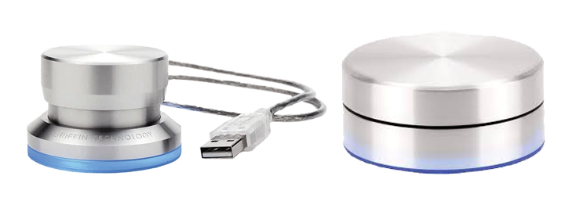
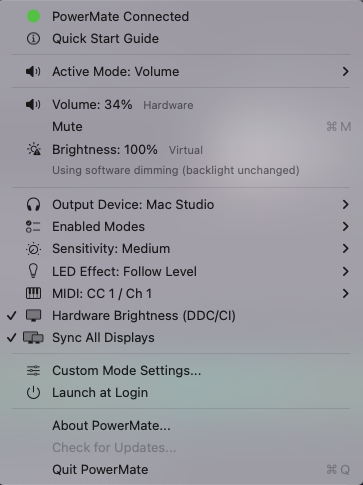

<div align="center">
  
</div>



Resurrecting the classic Griffin PowerMate USB for modern Mac setups (Apple Silicon and macOS Sequoia+). 

Since the official drivers haven't worked in years, this is a native Swift menu bar app built from scratch to bring that awesome piece of hardware back to life.

<div align="center">
  <a href="https://github.com/EricBintner/PowerMateReborn/releases/latest">
    
  </a>
</div>

## What It Does

Transform your Griffin PowerMate into a dedicated media control knob for your Mac. Four modes -- Volume, Brightness, MIDI, and Custom -- let you control anything from system audio to DAW plugins to arbitrary keyboard shortcuts, all with smooth LED feedback.

## Quick Start

| Gesture | Volume | Brightness | MIDI | Custom |
|---------|--------|------------|------|--------|
| **Rotate** | Adjust volume | Adjust brightness | Send MIDI CC | Per-profile action |
| **Tap** | Snap to 20% (toggle) | Snap to 15% (toggle) | Toggle note | Per-profile action |
| **Double-tap** | Mute / unmute | Sleep display | Toggle note | Per-profile action |
| **Long press** | Cycle mode | Cycle mode | Cycle mode | Per-profile action* |

*\*Custom mode can optionally override the long press to assign a custom action or an extended press (hold-to-sustain), which disables mode cycling from the knob while that profile is active.*

## Features



### Core Modes
- **Volume Mode** -- Controls all macOS audio devices via CoreAudio with intelligent fallback (Master > Channel > VirtualMaster > AppleScript > Software).
- **Brightness Mode** -- Adjusts built-in and external displays via DisplayServices, DDC/CI hardware, gamma tables, or overlay dimming. Syncs all monitors by default with relative offset preservation, or controls them individually based on mouse cursor position.
- **MIDI Mode** -- Creates a virtual CoreMIDI source ("PowerMate Knob") visible to any DAW. Knob rotation sends CC messages; button press sends note on/off. Configurable CC number and channel from the menu bar.
- **Custom Mode** -- Fully user-configurable per-application profiles. Assign any gesture to scroll, keyboard shortcuts, media keys, MIDI CC/Note, or OSC messages. See [Custom Mode](#custom-mode) below.

### System
- **Native Swift Driver** -- Pure IOKit HID implementation. No kernel extensions, no Rosetta.
- **Menu Bar App** -- Lightweight status item with mode indicator, output device picker, sensitivity control, and LED configuration.
- **Hardware LED Sync** -- LED ring brightness tracks the current level in real time.
- **Multi-Display Brightness** -- All monitors dim together by default (with relative offsets preserved). Uncheck "Sync All Displays" to control each monitor independently based on mouse position.
- **DDC/CI Hardware Brightness** -- Native I2C commands to external monitors for real backlight control, with instant gamma feedback for smooth knob feel.
- **Night Mode** -- Deep overlay dimming to near-black for any display type.
- **Native OSD** -- macOS-style volume/brightness overlay with SF Symbols and segmented level bar.
- **Sparkle Auto-Updates** -- EdDSA-signed updates via GitHub Pages appcast.
- **Launch at Login** -- One-click toggle via SMAppService.

## Custom Mode

Custom Mode lets you define what the PowerMate does on a per-application basis. Open **"Custom Mode Settings..."** from the menu bar to configure.

### How It Works
1. **Global Default** -- A base profile that applies when no app-specific profile matches.
2. **Per-App Profiles** -- Add any running application. When that app is in the foreground, the PowerMate automatically switches to its gesture mappings.
3. **Assignable Actions** -- Each gesture (Rotate Left, Rotate Right, Single Tap, Double Tap) can be assigned to:
   - **Scroll** -- Emulate mouse scroll wheel (Up / Down / Left / Right)
   - **Keyboard Shortcut** -- Any key combination (recorded live from the settings window)
   - **Media Control** -- Play/Pause, Next Track, Previous Track
   - **MIDI CC** -- Continuous controller with configurable CC number and channel
   - **MIDI Note** -- Note on/off with configurable note number, velocity, and channel
   - **OSC Message** -- Open Sound Control over UDP (configurable path, host, and port)

### Long Press / Extended Press Override
Each profile can optionally override the global "Cycle Mode" long press. When enabled:
- **Long Press** -- Triggers a custom action once after the hold delay.
- **Extended Press** -- Hold-to-sustain: the action fires when the hold threshold is met and stays active until the button is released (like holding a key on an organ). Works with Keyboard Shortcuts, MIDI Notes, and OSC.

Enabling this override disables the ability to cycle between modes from the knob itself while that profile is active. A clear warning is shown in the settings UI.

## Hardware Requirements

- **Supported Devices:** 
  - **Griffin PowerMate USB** (Vendor ID `0x077d`, Product ID `0x0410`)
  - **Griffin PowerMate Bluetooth** (Beta support via CoreBluetooth)
- **OS:** macOS 13+ (Optimized for Apple Silicon, macOS Sequoia)

> **Note on Bluetooth Support:** Bluetooth connectivity is currently in Beta. You can connect both a USB and a Bluetooth PowerMate simultaneously. The Bluetooth LED works, but the exact button and rotation mapping for the Bluetooth model is still undergoing real-hardware validation.

## Installation

1. Download the latest `.dmg` from [GitHub Releases](https://github.com/EricBintner/PowerMateReborn/releases).
2. Open the `.dmg` and drag **PowerMateReborn** to your Applications folder.
3. Launch the app. Grant **Accessibility** permissions if prompted (System Settings > Privacy & Security > Accessibility).

*Since the app is not yet notarized by Apple, you may need to right-click and select "Open" the first time.*

## Build from Source

```bash
cd PowerMateDriver
swift build
swift run
```

Requires Xcode 15+ and macOS 13+ SDK.

## Research & Documentation

Extensive research on modern macOS hardware control limitations and workarounds:
- [Audio Control Research](docs/research/RESEARCH_AUDIO.md) -- 7-tier volume control strategy
- [Brightness Control Research](docs/research/RESEARCH_BRIGHTNESS.md) -- 7-tier brightness strategy including DDC/CI deep dive

## License

This project is licensed under the MIT License - see the [LICENSE](LICENSE) file for details.
